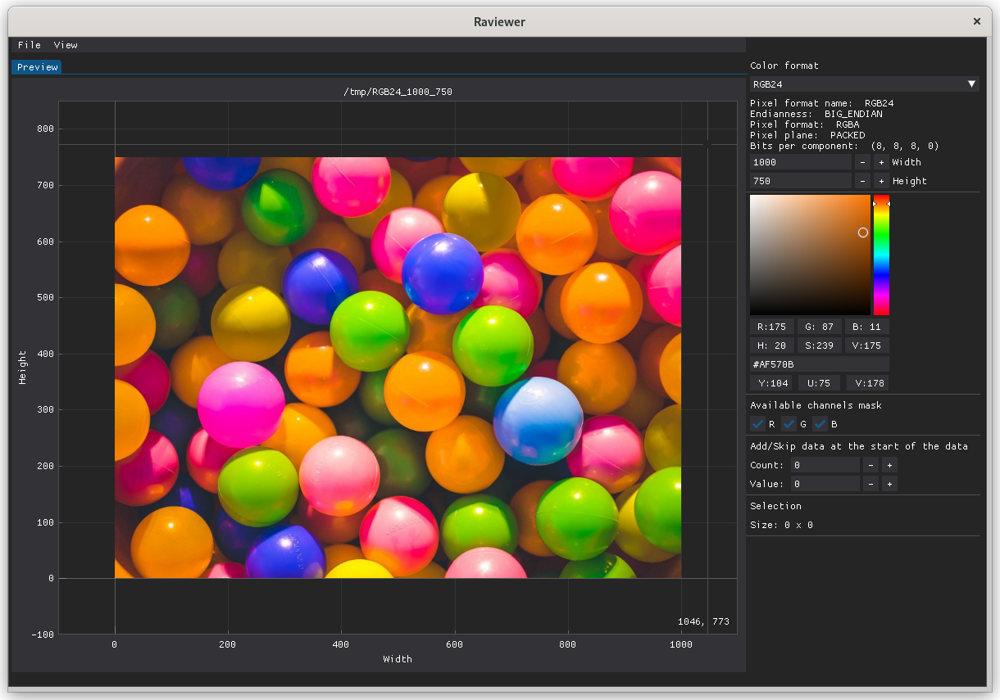

# Raviewer

Copyright (c) 2021-2022 [Antmicro](https://www.antmicro.com)

Raviewer is an open-source utility dedicated to parsing and displaying binary data acquired straight from a camera.



# Installation

## Requirements

* Python >= v3.9
* numpy
* opencv-python
* Pillow
* dearpygui == 1.1.1
* terminaltables
* pytest
* v4l2 (https://github.com/antmicro/python3-v4l2.git)

## Installation

### Arch Linux

```bash
sudo pacman -Sy python-pip git
pip install git+https://github.com/antmicro/raviewer.git
```

### Debian

```bash
sudo apt-get install python3-pip git python3-pil.imagetk
pip install git+https://github.com/antmicro/raviewer.git
```

# Usage

To start an empty GUI (without any data loaded) use:

```bash
raviewer
```

You can also start the GUI with already loaded data and parameters (like width and color format). More information about available arguments can be found in command-line help:

```bash
raviewer --help
```

## Core Features

* Hexadecimal preview mode
* An option to append or remove n bytes from the beginning of the image series
* Checkboxes controlling displayed channels
* Convertion whole or selected part of image to more complex formats(JPEG, PNG) or raw data.
* Terminal functionality
* On click displaying raw data making up a pixel as decoded rgb and yuv
* Theme menager adjusting font and theme preferences

## Supported formats information

Currently supported color formats and planned ones can be found [in the documentation](docs/SUPPORTED_FORMATS.md).

# Extending supported color formats

## Adding new color formats

Currently there are two classes that can describe color formats: `ColorFormat` and `SubsampledColorFormat` (found in `app/image/color_format.py`).
To create a new color format, simply:
#### *Step 1.*
Under `AVAILABLE_FORMATS` list in `color_format.py` add new instance of one of the color format classes with proper fields filled.
#### *Step 2.*
Provide parsing and displaying function by extending `AbstractParser` found in `common.py` or by using an existing one.
    If you choose to implement a new one remember that `parse()` should return one dimensional `ndarray` with values read from the binary file. `display()` on the other hand should return RGB-formatted 3-dimensional `ndarray` consisting of original color format values converted to RGB24.
#### *Step 3.*
The utility provides proper parser by checking color format parameters (mainly `PixelFormat`), so make sure, that your new color format has a valid translation of parameters to one of the parsers (this functionality can be found in `app/parser/factory.py`).

# License

The utility is licensed under the Apache-2 license. For details, please read [the LICENSE file](LICENSE).
