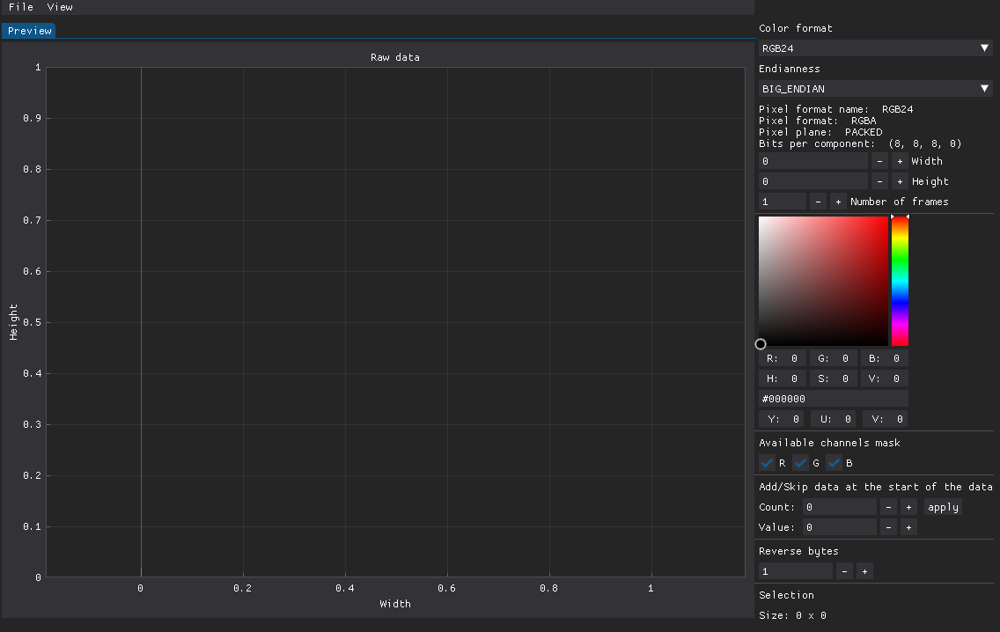
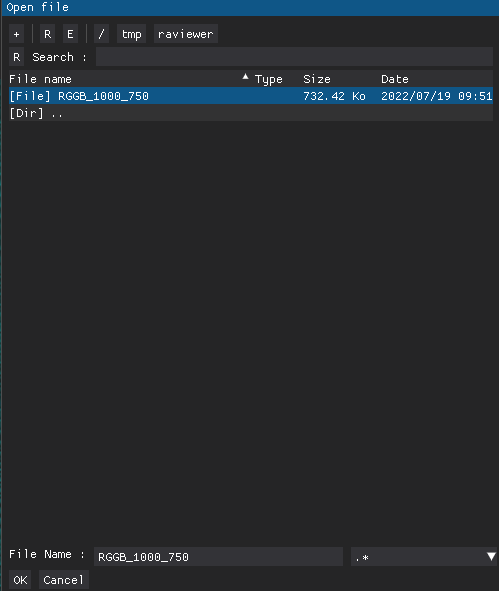
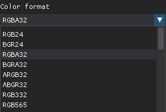

# Quick start

After installing Raviewer, you can start an empty GUI (without any data loaded) using:

```
raviewer
```

## GUI

Raviewer's GUI is divided into three sections: the work area on the left; properties settings on the right; and the top menu:



## Importing a file

You can import a file to Raviewer by clicking **File** > **Open** from the top menu and selecting the file of your choice:



## Choosing a color format

Raviewer supports a vast catalog of color formats, the full list of which you can see in the [chapter devoted to color formats](formats).

Depending on the sensor you are extracting data from, RAW files can use one of many color formats.
You need to select the color format of your file from the **Color format** dropdown menu:



## Setting the resolution

After choosing an appropriate color format for your file, you must adjust the resolution setting to display the preview properly.


The default width in Raviever is 800px, and the height is calculated automatically, so in most cases, you can omit the latter.

```{note}
You can change the resolution in Raviewer using [command line arguments](command-line-arguments), but you must specify the path to the file you want to open for it to work properly.

To open a file with a resolution of 1000x750, you would run:

```bash
raviewer -w 1000 -H 750 -f /path/to/file
```

The preview should produce a correct, good-looking image if you have set the appropriate color format, [endianness](changing-endianness), and resolution.

(controlling-color-channels)=

## Controlling color channels

One of the common mistakes you may encounter when working with imported files is the swapped color channels.
You can change the displayed color channels to determine if they have been properly assigned.

```{note}
In some color formats, you can also see if the alpha channel is working correctly.
```

You can easily control which color channel masks are currently being displayed by checking or unchecking boxes on the menu:


Unchecking a box will cause the values of a chosen channel to be set to 0 on every pixel of the picture (except for the alpha channel, which is set to its maximum value).

To see how controlling color channels may help you identify issues with your frames, have a look at this BGR24 frame:


When you select another, wrong color format (in this case, RGB24), you can see that the colors do not match the original ones:


To quickly identify the root of the problem, turn the color channels on and off.
When only the red channel is turned on, balls that are blue in reality are shown as very bright:


When only the blue channel is turned on, in reality, orange, pink, or red balls are shown as very bright.


That means that channels R and B are swapped, and the format of our frame is not RGB24 but BGR24.

(selecting-an-area)=

## Selecting an area

You can select an area of your picture by holding **LMB** (left mouse button) and dragging it over your screen.
The selected area will be highlighted in green, and you can see its size in the bottom-right corner.

The selected area can then be exported to PNG by selecting **File** > **Export** > **PNG** > **Selection** from the top menu, or to RAW by selecting **File** > **Export** > **RAW** > **Selection**.

(zooming-in)=

## Zooming in

You can zoom in on an area of your picture by holding **RMB** (right mouse button) and dragging it over your screen.
The selected area will be highlighted in yellow, and upon releasing **RMB**, Raviewer will fill the whole available workspace with the selected area.

(color-picker)=

## Color picker

You can display raw data making up a pixel by using **MMB** (middle mouse button).
It will show you RGB and YUV values as well as the hue, saturation, and lightness of a pixel.
You will also be able to see the information about the bytes in a component:


Bytes in components display the channel value in the selected format.
You can use this information to determine if the color channel values are correct.

The color picker can help you spot anomalies within your files, like the alpha channel not being set to its maximum value on a picture without transparent elements.

```{note}
Color channel values in the color picker differ from those on the right side because the former have been converted to their 8-bit RGB counterparts.
```

The **Bytes in components** window can be closed using **RMB** anywhere in the window.

(exporting-data)=

## Exporting data

Using the top menu, you can export data from Raviewer to PNG or RAW format.

To export a file to PNG, use: **File** > **Export** > **PNG** > **Image**.

To export a file to RAW, use: **File** > **Export** > **RAW** > **Image**.

You can also [export only a snippet of your picture](selecting-an-area).
