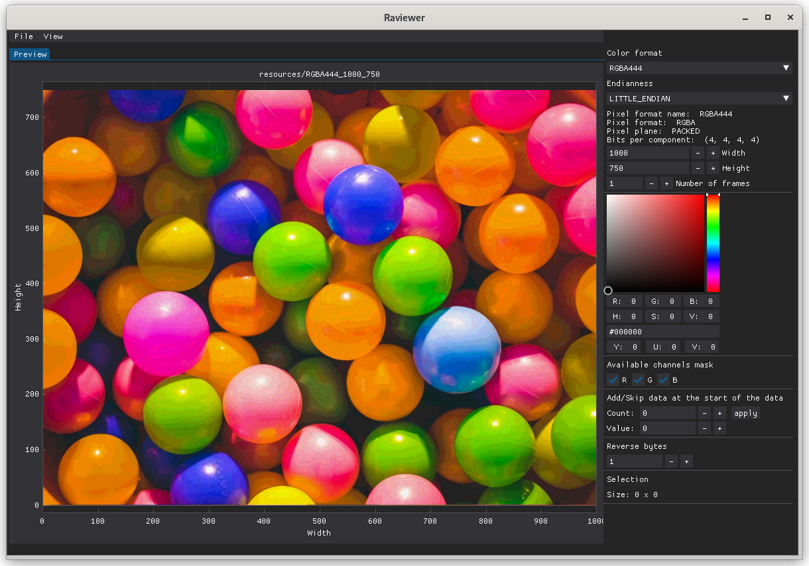
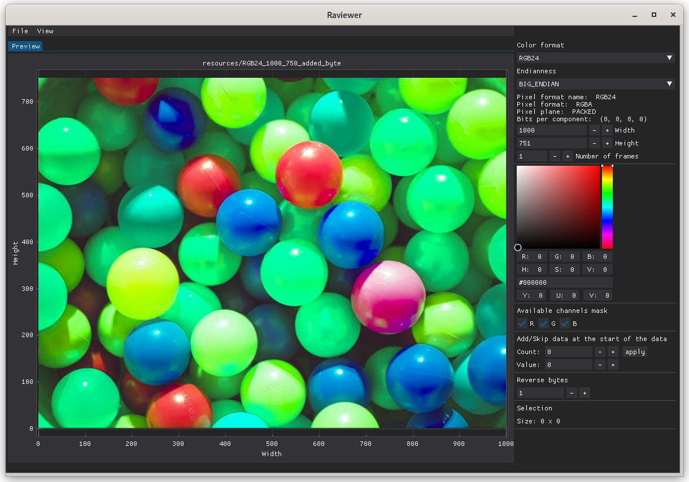
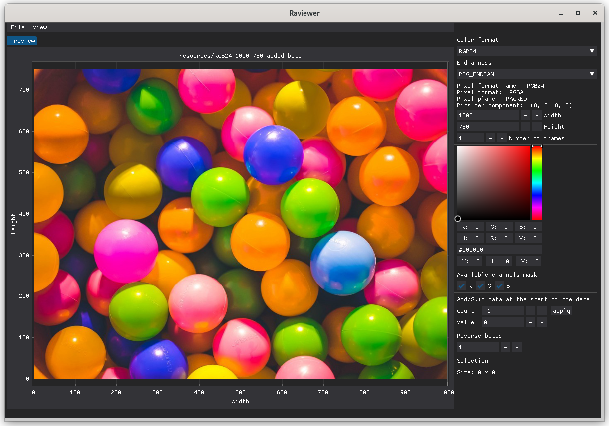
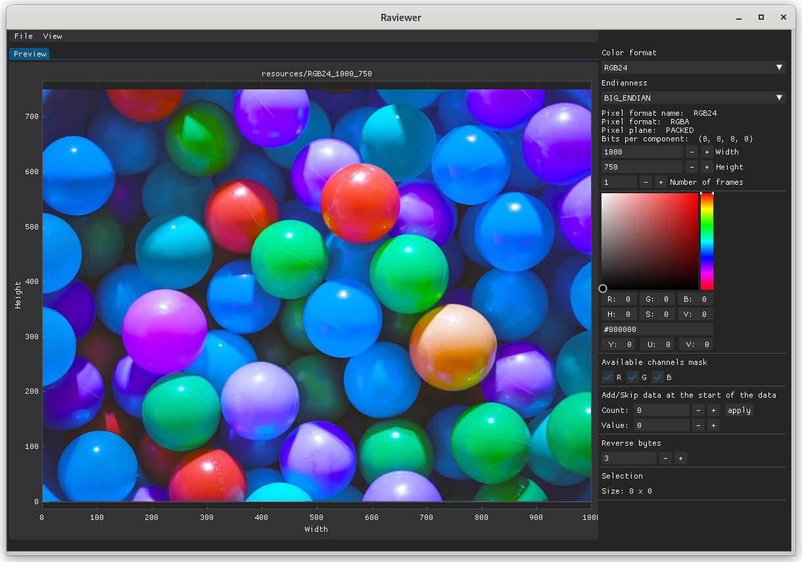
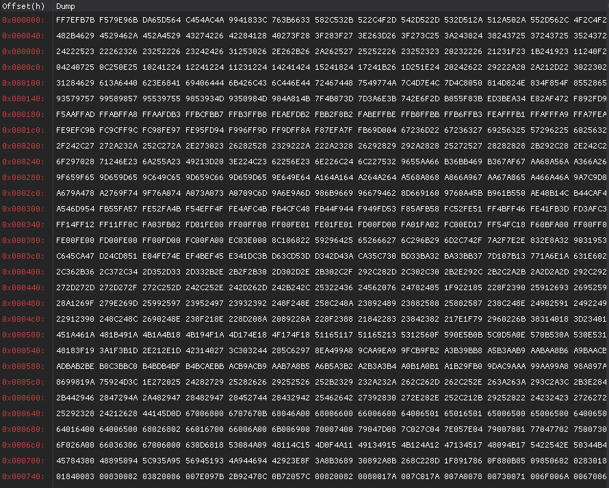
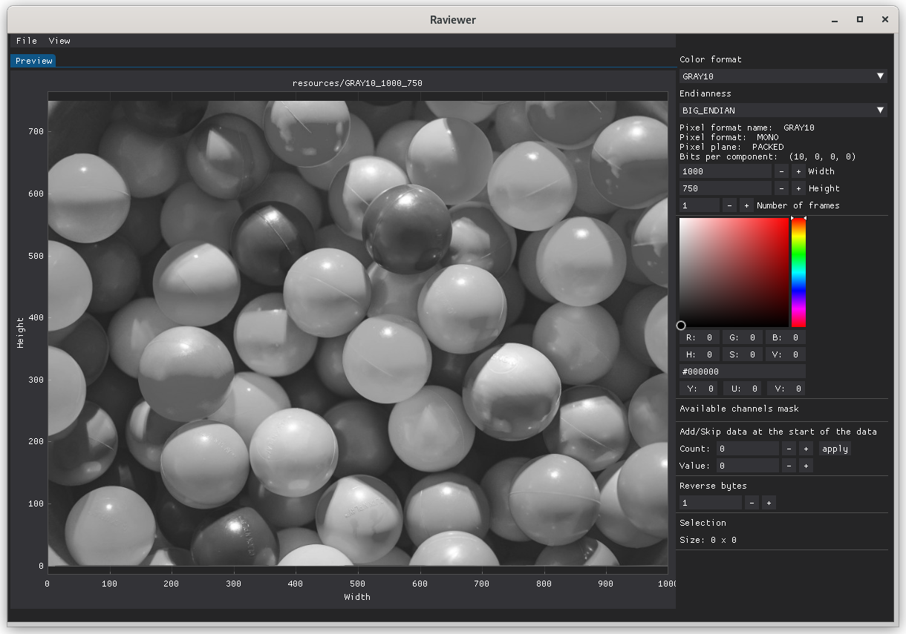

# Usage

This chapter describes more advanced functionalities, but if you want to see how to perform the most basic operations in Raviewer, visit [Quick start chapter](quickstart.md).

(command-line-arguments)=

## Command line arguments

Raviewer can be launched with already loaded data and parameters (like width or color format).
You can find more information about available arguments in command-line help:

```
raviewer --help
```

You can find examples of usage of the available commands in the table below:

```{list-table} Raviewer's CL arguments
:header-rows: 1
:widths: 1 1

* - Command
  - Description
* - -h (or -\\-help)
  - Show help message and exit
* - -c (or -\\-color_format) COLOR_FORMAT
  - Target [color format](formats.md) (default: RGB24)
* - -f (or -\\-FILE_PATH) FILE_PATH
  - File containing raw image data
* - -w (or -\\-width) WIDTH
  - Target width (default: 800)
* - -H (or -\\-height) HEIGHT
  - Target height
* - -e (or -\\-export) RESULT_PATH
  - Destination file for the parsed image
* - --list-formats 
  - List available predefined formats
* - --check-formats 
  - Test all formats
```

(changing-endianness)=

## Changing endianness

The order in which a sequence of bytes is stored can vary in the binary files you import to Raviewer.
When working with RAW files, you don't always know your data's format; to determine it, you will have to tweak the endianness and bytes settings.

There are 2 types of endianness to choose from in the Raviewer's options: Big Endian and Little Endian.
When using Big Endian, the most significant byte is placed at the byte with the lowest address, while in Little Endian, the lowest address is occupied by the least significant byte.

To accommodate that, you may need to change the endianness setting in the right side menu:


Each color format stores the data differently, and selecting the right endianness is necessary for the frame to render correctly.
A pixel in RGBA444 format consists of 2 bytes.
The first bytes contain information about the B and A channels, and the second one about R and G.

Take a look at this RGBA444 frame:



If we change the endianness, we swap the order of the 2 bytes constituting the color format, so the B channel swaps with R and the A channel swaps with G, making the picture look like this:


(adding-skipping-bytes)=

## Adding and skipping bytes

Some RAW files may include additional data before the actual picture, like header information.
You may need to remove or replace the first bytes to display the image correctly.
The data can be skipped or replaced with a value of your choosing.

You can add or skip data at the beginning of your binary data by changing the **Count** and the **Value**:


Changing the **Count** changes the number of bytes to append (or skip), while **Value** changes the value of bytes to append.

Some frames, like RGB24 shown below, have an additional byte in front of the actual picture data, which prevents Raviewer from displaying it correctly:



After skipping it (by setting the count to -1), the frame displays as it should:



(reversing-bytes)=

## Reversing bytes

In some cases, the picture may not look properly after the initial loading of your RAW data.
One of the reasons for this might be the reversed order of bytes in the imported file.

You can reverse the order of the bytes in your input data using the right-side menu.
To do it, change the value in the **Reverse bytes** setting (the default value is 1).


Reversing bytes enables you to expose similarities between some color formats.
By loading the RGB24 frame:


Then set the value of the reverse byte setting to 3:



Your frame will now be compatible with the BGR24, and after changing the color format setting to it, it will display correctly:  
 


(hexadecimal-preview-mode)=

## Hexadecimal preview mode

Using hexadecimal preview mode, you can inspect the raw data of your picture by analyzing its hex values instead of inspecting its pixels.
It helps you determine whether the picture has been converted or modified, so you can use the proper tools to analyze it.

This tool gives you the ability to, for example, see whether the pixel has added padding, which is not possible to determine by just looking at it.

To inspect the hex dump of the imported file, you need to click **View** > **Hexdump** to turn on this view.
It will now be visible next to the **Preview** view:



Now you can inspect the contents of your binary files in hexadecimal and ASCII form.

In the Hexdump tab, we can see that in GRAY10 format, every pixel has padding that consists of 0s.




(theme-manager)=

## Theme manager

Raviewer uses [Dear PyGui](https://dearpygui.readthedocs.io/en/latest/index.html) to create its user interface.
It allows you to easily change various aspects of your GUI, like colors, fonts, and many more.
ou can find more detailed information on managing the themes in the appropriate section of the [Dear PyGui documentation](https://dearpygui.readthedocs.io/en/latest/documentation/themes.html).

To create a new theme, you must edit the `theme_config.py` file in the `raviewer/styles_config`.
To edit the global theme, simply add the formulas in the appropriate line:

```python
with dpg.theme() as items.theme.general:
    with dpg.theme_component(dpg.mvAll):
        pass
        dpg.add_theme_color(dpg.mvThemeCol_FrameBg, (150, 50, 50), category=dpg.mvThemeCat_Core)
        dpg.add_theme_style(dpg.mvStyleVar_FrameRounding, 20, category=dpg.mvThemeCat_Core)
        dpg.show_style_editor()
```

The last three lines modify the background color to red, make the window frames more round, and open the style editor when you launch Raviewer:


You can find a complete list of modifiable elements [here](https://dearpygui.readthedocs.io/en/latest/documentation/themes.html#plot-markers).
